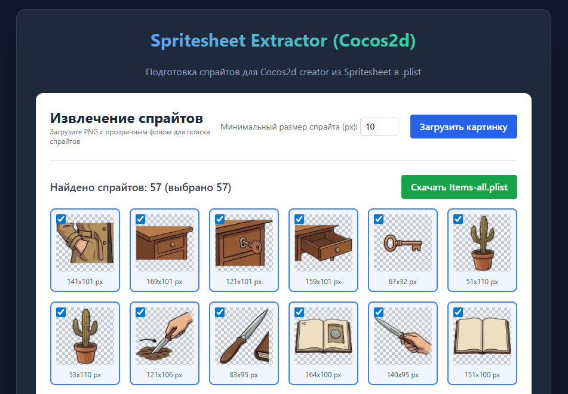

# SpriteTools



SpriteTools is a powerful web-based utility designed for game developers to simplify the process of working with sprite atlases and texture sheets.

## 🚀 Features

### Cocos Sprite Extractor
Automatically analyze and extract individual sprites from a single PNG image. 
- **Automatic Detection**: Uses a BFS (Breadth-First Search) algorithm to identify unique sprites based on pixel transparency.
- **Configurable Threshold**: Adjustable minimum sprite size to filter out noise.
- **Cocos Creator Support**: Generates and downloads a `.plist` file compatible with Cocos Creator.
- **Visual Selection**: Preview found sprites and select exactly which ones you want to export.

### Global Localization
The interface supports multiple languages to accommodate developers worldwide:
- 🇺🇸 English
- 🇷🇺 Russian
- 🇨🇳 Chinese

## 🛠️ Tech Stack

- **Framework**: [React 19](https://react.dev/)
- **Build Tool**: [Vite](https://vitejs.dev/)
- **Language**: [TypeScript](https://www.typescriptlang.org/)
- **Styling**: [Tailwind CSS](https://tailwindcss.com/)
- **Localization**: [i18next](https://www.i18next.com/)

## ⚙️ Getting Started

### Prerequisites
- Node.js (Latest LTS recommended)
- npm or yarn

### Installation

1. Install dependencies:
   ```bash
   npm install
   ```

2. Run the development server:
   ```bash
   npm run dev
   ```

3. Build for production:
   ```bash
   npm run build
   ```

## 📜 License

[MIT License](https://opensource.org/licenses/MIT)

---
*Built for efficient game asset management.*